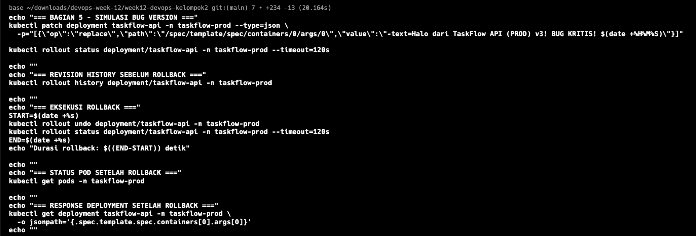
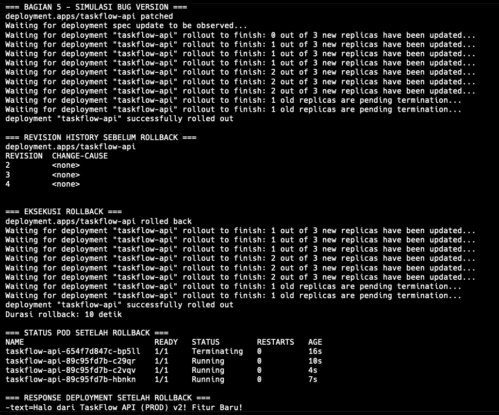

# Insiden 3 - Rollback Cepat

## Analisis Masalah Lama

Pada arsitektur lama, rollback dilakukan secara manual langsung di server production. Tim harus SSH ke server, menghentikan container yang bermasalah, menarik image versi lama, menjalankan ulang container, lalu memastikan konfigurasi port dan environment tetap benar. Proses ini memakan waktu sekitar 25 menit dan berisiko tinggi karena banyak langkah manual.

## Solusi Kubernetes

Kubernetes menyimpan riwayat revisi Deployment. Setelah rolling update selesai, versi sebelumnya masih dapat dipulihkan menggunakan satu perintah:

```bash
kubectl rollout undo deployment/taskflow-api -n taskflow-prod
```

Deployment `taskflow-api` juga menyimpan riwayat revisi lewat `revisionHistoryLimit: 5`, sehingga Kubernetes tetap memiliki ReplicaSet lama yang dapat dipakai untuk rollback.

## Langkah Pengujian

### 1. Pastikan Deployment Berada di Versi Baru

```bash
kubectl rollout history deployment/taskflow-api -n taskflow-prod
kubectl get pods -n taskflow-prod
```

Deployment berada pada versi hasil rolling update dari Bagian 4, yaitu response:

```text
Halo dari TaskFlow API (PROD) v2! Fitur Baru!
```

### 2. Jalankan Rollback

```bash
START=$(date +%s)
kubectl rollout undo deployment/taskflow-api -n taskflow-prod
```

### 3. Pantau Status Rollback

```bash
kubectl rollout status deployment/taskflow-api -n taskflow-prod
END=$(date +%s)
echo "Durasi rollback: $((END-START)) detik"
```

### 4. Verifikasi Pod Setelah Rollback

```bash
kubectl get pods -n taskflow-prod
kubectl rollout history deployment/taskflow-api -n taskflow-prod
```

Jika menggunakan port-forward:

```bash
kubectl port-forward svc/taskflow-api 8080:80 -n taskflow-prod
curl http://localhost:8080
```

## Hasil Pengujian

Rollback diuji dengan membuat revisi sementara `v3! BUG KRITIS!`, lalu menjalankan `kubectl rollout undo`. Kubernetes mengganti Pod versi baru dengan Pod dari revisi sebelumnya secara bertahap. Karena Deployment menggunakan strategi RollingUpdate dengan `maxUnavailable: 0`, service tetap tersedia selama rollback berlangsung.

Output rollback:

```text
deployment.apps/taskflow-api rolled back
deployment "taskflow-api" successfully rolled out
Durasi rollback: 10 detik
```

Status Pod setelah rollback:





```text
NAME                            READY   STATUS        RESTARTS   AGE
taskflow-api-654f7d847c-bp5ll   1/1     Terminating   0          16s
taskflow-api-89c95fd7b-c29qr    1/1     Running       0          10s
taskflow-api-89c95fd7b-c2yqy    1/1     Running       0          4s
taskflow-api-89c95fd7b-hbnkn    1/1     Running       0          7s
```

Verifikasi response Deployment setelah rollback:

```text
-text=Halo dari TaskFlow API (PROD) v2! Fitur Baru!
```

| Bukti | Hasil |
| --- | --- |
| Durasi rollback | 10 detik |
| Status rollout | `deployment "taskflow-api" successfully rolled out` |
| Status Pod | 3 Pod stabil `Running`, 1 Pod lama `Terminating` |

## Tabel Perbandingan

| Aspek | Cara Lama | Dengan Kubernetes |
| --- | --- | --- |
| Langkah | SSH -> stop container -> pull image lama -> run ulang -> config ulang | `kubectl rollout undo deployment/taskflow-api -n taskflow-prod` |
| Waktu | Sekitar 25 menit | Target kurang dari 60 detik |
| Risiko | Tinggi karena banyak langkah manual | Rendah karena rollback dikontrol oleh Deployment |
| Dampak ke user | Berpotensi downtime saat container dihentikan | Tetap tersedia karena rolling rollback |

## Kesimpulan

Insiden 3 dapat dicegah karena rollback tidak lagi dilakukan secara manual dari server. Kubernetes cukup diberi perintah `rollout undo`, lalu Control Plane mengembalikan Deployment ke revisi sebelumnya dan menjaga jumlah Pod tetap sesuai konfigurasi.
